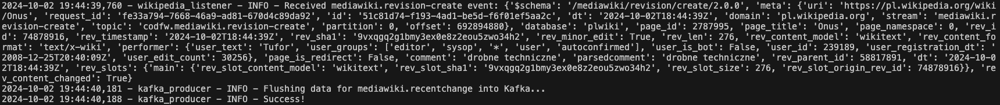
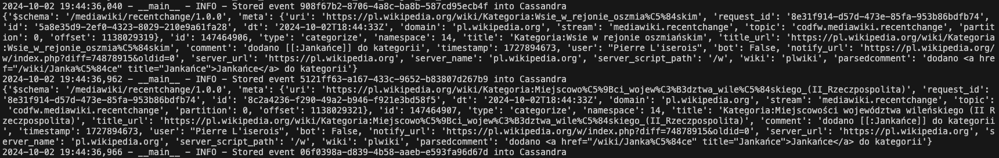
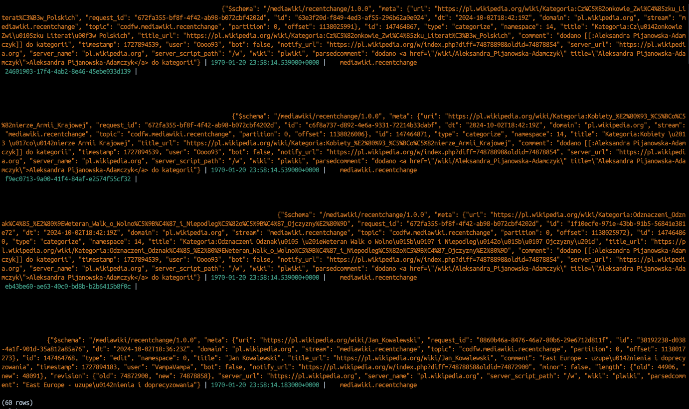

# Wikipedia data through Kafka to Cassandra

## Overview
Main objective of the project is to gather streamed data from Wikimedia Event Streams API, store them in Apache Kafka, handle both Producer and Consumer side using Python and persist results into Cassandra. 

This project was supposed to be bigger and have real analytics connected. I quickly found out that this Wikimedia data being free means it's also pretty useless. Probably this will work as a skeleton for any SSE-like vendors in the future.

More about WikiMedia Event Streams [here](https://wikitech.wikimedia.org/wiki/Event_Platform/EventStreams_HTTP_Service).
## Getting started

```bash
docker-compose pull
docker-compose up -d
```

### Configuration
Update the configuration files as necessary, particularly for the Kafka and Cassandra setup. See config/ingestion.yaml for specific settings related to the Wikipedia stream.

### Running the Application
To start the Kafka producer and listener, execute the following command:
```bash
python kafka_producer.py
```

To initialize Cassandra, run:
```bash
python init_cassandra.py
```

To start consuming from the Kafka topic and inserting into Cassandra:
```bash
python kafka_to_cassandra.py
```

### Kafka Topic Consumption
To check messages in the Kafka topic wikipedia, you can use the following command:
```bash
docker exec -it <kafka_container_name> /bin/bash
kafka-console-consumer.sh --bootstrap-server localhost:9092 --topic wikipedia --from-beginning
```


## Cassandra Table Structure

The following table structure is used to store the events:

- Keyspace: wikipedia_stream
- Table: events
- - `id`: UUID (Primary Key)
- - `event_time`: TIMESTAMP
- - `event_type`: TEXT
- - `event_data`: TEXT

## Run
Listener and to Kafka:

Kafka to cassandra:

Cassandra:



## License
Distributed under the MIT License. See LICENSE.txt for more information.